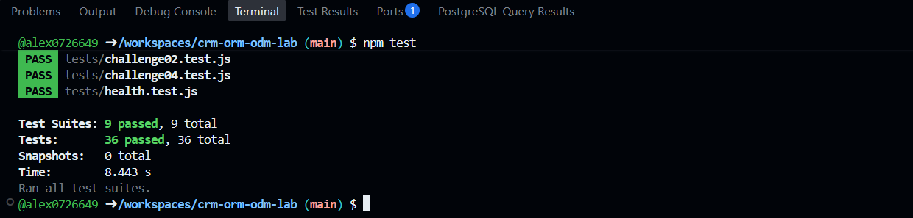

# CRM ORM/ODM Lab

API REST de un CRM básico que combina un ORM (Sequelize + PostgreSQL) y un ODM (Mongoose + MongoDB).

## Stack

- Node.js 22, Express 5, CommonJS
- Sequelize + PostgreSQL 16 (`User`, `Company`, `Contact`)
- Mongoose + MongoDB 7 (`Activity`)
- Jest + Supertest
- GitHub Codespaces, Dev Containers, Docker Compose
- Supervisor (`npm run dev`)

## Arquitectura

```text
GitHub Codespace
│
├── app       Node.js 22  ──┬── Sequelize ──> postgres (PostgreSQL)
│                           └── Mongoose  ──> mongo    (MongoDB)
├── postgres
└── mongo
```

La aplicación se conecta por nombre de servicio (`postgres`, `mongo`). Las credenciales de desarrollo llegan como variables de entorno definidas en `.devcontainer/docker-compose.yml` (ver `.env.example`).

## Iniciar el Codespace

1. En GitHub: **Code → Codespaces → Create codespace on main**.
2. Espera a que se levanten los tres servicios (`app`, `postgres`, `mongo`). `postCreateCommand` ejecuta `npm install`.

## Instalar dependencias

```bash
npm install
```

## Seed y reset

```bash
npm run seed    # inserta datos deterministas (3 users, 4 companies, 8 contacts, 10 activities)
npm run reset   # elimina y recrea tablas/base de datos y vuelve a sembrar
```

## Iniciar la API

```bash
npm start       # node ./bin/www
npm run dev     # supervisor ./bin/www
```

Servidor en el puerto `3000` (variable `PORT`).

## Pruebas

```bash
npm test
```

Cada suite restablece PostgreSQL y MongoDB antes de ejecutarse y cierra las conexiones al terminar.

## Endpoints

| Método | Ruta | Descripción |
|---|---|---|
| GET | `/health` | Health check |
| GET | `/users` | Listar usuarios |
| GET | `/users/:id` | Obtener usuario |
| POST | `/users` | Crear usuario |
| PUT | `/users/:id` | Actualizar usuario |
| DELETE | `/users/:id` | Eliminar usuario |
| GET | `/companies` | Listar compañías (`?industry=`) |
| GET | `/companies/:id` | Obtener compañía |
| POST | `/companies` | Crear compañía |
| PUT | `/companies/:id` | Actualizar compañía |
| DELETE | `/companies/:id` | Eliminar compañía |
| GET | `/contacts` | Listar contactos |
| GET | `/contacts/:id` | Obtener contacto |
| POST | `/contacts` | Crear contacto |
| PUT | `/contacts/:id` | Actualizar contacto |
| DELETE | `/contacts/:id` | Eliminar contacto |
| GET | `/activities` | Listar actividades (`?type=`) |
| GET | `/activities/:id` | Obtener actividad |
| POST | `/activities` | Crear actividad |
| PUT | `/activities/:id` | Actualizar actividad |
| DELETE | `/activities/:id` | Eliminar actividad |

Los errores se devuelven como JSON: `{ "error": "Contact not found" }`.

## Respuestas
1.Dos motores: 
Activity es ideal para MongoDb ya que la información extra, o sea metadata va cambiando segun el tipo de actividad, y los modelos NoSQL nos da esa opción, pero para Company y Contact Postgre es una buena opcion porque los datos son estructurados y fijos y ademas requieren estar relacionados

2.ORM vs ODM
El ORM mapea el codigo con tablas de una base relacional aqui se implemento Sequelize, el ORM tiene tablas "rigidas" por asi decirlo y se tiene que manejar con JOINS, en cambio ODM usa documentos en formato JSON que son mas libres y se uso Mongoose en este caso.

3.Configuracion por variables de entorno: 
Estan en el archivo .env, porque de ponerlas en un .js y subir eso a Github expone las contraseñas a cualquier persona con acceso al repositorio, el host de DB_HOST es postgres y el host de MONGODB es mongo y no son localhost porque las bases de datos estan corriendo en contenedores de Docker.

4.Asociaciones:
La relaciones que una compañia tiene muchos contactos, la llave foranea es el id de la compañia y esta en la tabla de Contacts, tener el alias 'contacts' es para indicar donde vamos a guardar todo en el arreglo de contactos.

5.Eager loading:
Para que hacer 2 consultas por separado y que vayan a pedir la informacion al servidor cuando con el Include podemos hacer un JOIN haciendo la consulta mas rapida.

6.Instancia vs Consulta:
Al actualizar sobre la instancia se busca el registro, se valida y despues devuelve el contacto ya modificado y listo, en cambio sobre consulta se hace el cambio instantaneo en la base de datos pero solo te devuelve las filas afectadas.

7.Esquema Flexible:
usa un Object que es Mixed lo que nos permite guardar cualquier JSON, lo que podria ser una desventaja porque no se valida que viene dentro, puediendo llegar a guardar datos incosistentes.

8.Sin ref:
No se pueden usar porque tanto User como Contact estan guardados en Postgre y no en Mongo, por lo que si borramos un usuario en Postgres no hay como verificar la relacion que hay entre estas 2 bases de datos.

9.Documento Actualizado:
Mongoose devolvia la versión vieja porque findByIdAndUpdate es asi por defecto, al agregar el new : true y el runValidators: true forzamos a que devuelva el documento que acabamos de modificar.

10.Pruebas de comportamiento:
Probar la respuesta final de la API nos da la libertad de reeestructurar o cambiar el código sin romper los tests, siempre y cuando la API le siga respondiendo lo correcto al cliente.

11.Repetibilidad:
Borra la base de datos y vuelve a cargar los datos de prueba antes y despues de cada test, y se hace para que cada prueba corra en un ambiente limpio y que los npm test den el mismo resultado siempre una vez que ya esten correctos.

12.Tu experiencia: 
El reto mas complicado fue el 8 porque me fallaba la respuesta, seguia con los datos antiguos. Cuando revise me di cuenta que no estaba pasando el parametro new: true, que aunque lo tenia en mente no lo habia escrito y pensando que me iba a salir a la primera tuve que leer todo de nuevo linea por linea

## Evidencias

